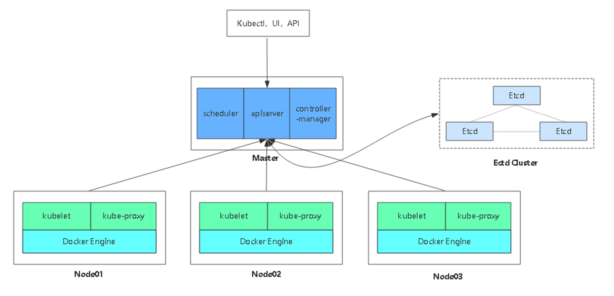
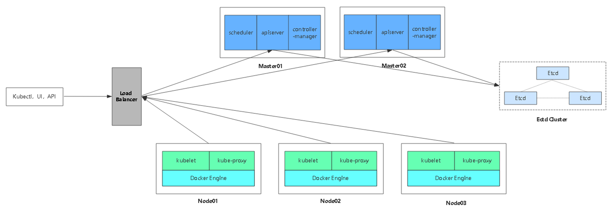

[TOC]

# 一、Kubernetes平台环境规划

## 1.环境

|     软件      | 版本          |
| :-----------: | :------------ |
| Linux操作系统 | CentOS7.6_x64 |
|  Kubernetes   | 1.15.3        |
|    Docker     | 19.03.1       |
|     Etcd      | 3.x           |
|    Flannel    | 0.10          |


## 2.组件分配规划

| 角色                    | IP                                | 组件                                                         |
| ----------------------- | --------------------------------- | ------------------------------------------------------------ |
| Master01                | 192.168.1.244                     | etcd、Kube-apiserver、Kube-controller-manager、Kube-scheduler、docker、flannel |
| Master02                | 192.168.1.245                     | etcd、Kube-apiserver、Kube-controller-manager、Kube-scheduler、docker、flannel |
| Node01                  | 192.168.1.246                     | etcd、kubelet、Kube-Proxy、docker、flannel                   |
| Node02                  | 192.168.1.247                     | kubelet、Kube-Proxy、docker、flannel                         |
| Load Balancer  (Master) | 192.168.1.248、192.168.1.241(VIP) | Nginx  keepalibed                                            |
| Load Balancer  (Backup) | 192.168.1.249、192.168.1.241(VIP) | Nginx  keepalibed                                            |


- 单集群架构图




- 多Master集群架构图



# 二、官方提供的三种部署方式


## 1.minikube  

Minikube是一个工具，可以在本地快速运行一个单点的Kubernetes，仅用于尝试Kubernetes或日常开发的用户使用。 部署地址：https://kubernetes.io/docs/setup/minikube/

## 2.kubeadm  

Kubeadm也是一个工具，提供kubeadm init和kubeadm join，用于快速部署Kubernetes集群。 部署地址：https://kubernetes.io/docs/reference/setup-tools/kubeadm/kubeadm/

## 3.二进制包

推荐，从官方下载发行版的二进制包，手动部署每个组件，组成Kubernetes集群。 下载地址：https://github.com/kubernetes/kubernetes/releases


## 4.部署前准备(重要！！)

```

#关闭
1.setenforce 0

#关闭防火墙
2.systemctl stop firewalld

#修改主机名
3.hostname master01

#时间同步
4.
yum -y install ntpdate
ntpdate time2.aliyun.com

#（1）永久关闭swap分区
5.sed -ri 's/.*swap.*/#&/' /etc/fstab

#（2）临时关闭swap分区, 重启失效;
swapoff -a


```


# 三、自签SSL证书

| **组件**       | **使用的证书**                             |
| -------------- | ------------------------------------------ |
| etcd           | ca.pem，server.pem，server-key.pem         |
| flannel        | ca.pem，server.pem，server-key.pem         |
| kube-apiserver | ca.pem，server.pem，server-key.pem         |
| kubelet        | ca.pem，ca-key.pem                         |
| kube-proxy     | ca.pem，kube-proxy.pem，kube-proxy-key.pem |
| kubectl        | ca.pem，admin.pem，admin-key.pem           |

### 1.生成etcd证书

```shell
$mkdir k8s
$cd k8s
$mkdir etcd-cert k8s-cert
$cd etcd-cert
更改etcd节点IP后运行一下两个脚本（cfssl.sh、etcd-cert.sh）
$sh ./cfssl.sh
$sh ./etcd-cert.sh

```

#####  cfssl.sh      #生成证书用到的工具cfssl

```shell
curl -L https://pkg.cfssl.org/R1.2/cfssl_linux-amd64 -o /usr/local/bin/cfssl
curl -L https://pkg.cfssl.org/R1.2/cfssljson_linux-amd64 -o /usr/local/bin/cfssljson
curl -L https://pkg.cfssl.org/R1.2/cfssl-certinfo_linux-amd64 -o /usr/local/bin/cfssl-certinfo
chmod +x /usr/local/bin/cfssl /usr/local/bin/cfssljson /usr/local/bin/cfssl-certinfo
```

#####  etcd-cert.sh   #开始创建证书

```yaml
cat > ca-config.json <<EOF
{
  "signing": {
    "default": {
      "expiry": "87600h"
    },
    "profiles": {
      "www": {
         "expiry": "87600h",
         "usages": [
            "signing",
            "key encipherment",
            "server auth",
            "client auth"
        ]
      }
    }
  }
}
EOF

cat > ca-csr.json <<EOF
{
    "CN": "etcd CA",
    "key": {
        "algo": "rsa",
        "size": 2048
    },
    "names": [
        {
            "C": "CN",
            "L": "Beijing",
            "ST": "Beijing"
        }
    ]
}
EOF

cfssl gencert -initca ca-csr.json | cfssljson -bare ca -

#-----------------------

cat > server-csr.json <<EOF
{
    "CN": "etcd",
    "hosts": [
    "192.168.1.244",
    "192.168.1.245",
    "192.168.1.246"
    ],
    "key": {
        "algo": "rsa",
        "size": 2048
    },
    "names": [
        {
            "C": "CN",
            "L": "BeiJing",
            "ST": "BeiJing"
        }
    ]
}
EOF

cfssl gencert -ca=ca.pem -ca-key=ca-key.pem -config=ca-config.json -profile=www server-csr.json | cfssljson -bare server

```


# 四.Etcd数据库集群部署


## 1.二进制包下载地址

https://github.com/etcd-io/etcd/releases

**etcd-v3.3.10-linux-amd64.tar.gz**

## 2.解压安装

```shell
wget https://github.com/etcd-io/etcd/releases/download/v3.3.15/etcd-v3.3.15-linux-amd64.tar.gz
tar -zxvf etcd-v3.3.15-linux-amd64.tar.gz
cd etcd-v3.3.15-linux-amd64
mkdir -p /opt/etcd/{ssl,cfg,bin}
mv etcd etcdctl /opt/etcd/bin/
#拷贝证书到指定目录
cp /root/k8s/etcd-cert/{ca,server-key,server}.pem /opt/etcd/ssl
```


部署配置ETCD，创建配置文件，和启动文件

```shell
sh ./etcd.sh etcd01 192.168.1.244 etcd02=https://192.168.1.245:2380,etcd03=https://192.168.1.246:2380

```

#### etcd.sh 

```shell
#!/bin/bash
# example: ./etcd.sh etcd01 192.168.1.10 etcd02=https://192.168.1.11:2380,etcd03=https://192.168.1.12:2380

ETCD_NAME=$1
ETCD_IP=$2
ETCD_CLUSTER=$3

WORK_DIR=/opt/etcd

cat <<EOF >$WORK_DIR/cfg/etcd
#[Member]
ETCD_NAME="${ETCD_NAME}"
ETCD_DATA_DIR="/var/lib/etcd/default.etcd"
ETCD_LISTEN_PEER_URLS="https://${ETCD_IP}:2380"
ETCD_LISTEN_CLIENT_URLS="https://${ETCD_IP}:2379"

#[Clustering]
ETCD_INITIAL_ADVERTISE_PEER_URLS="https://${ETCD_IP}:2380"
ETCD_ADVERTISE_CLIENT_URLS="https://${ETCD_IP}:2379"
ETCD_INITIAL_CLUSTER="etcd01=https://${ETCD_IP}:2380,${ETCD_CLUSTER}"
ETCD_INITIAL_CLUSTER_TOKEN="etcd-cluster"
ETCD_INITIAL_CLUSTER_STATE="new"
EOF

cat <<EOF >/usr/lib/systemd/system/etcd.service
[Unit]
Description=Etcd Server
After=network.target
After=network-online.target
Wants=network-online.target

[Service]
Type=notify
EnvironmentFile=${WORK_DIR}/cfg/etcd
ExecStart=${WORK_DIR}/bin/etcd \
--name=\${ETCD_NAME} \
--data-dir=\${ETCD_DATA_DIR} \
--listen-peer-urls=\${ETCD_LISTEN_PEER_URLS} \
--listen-client-urls=\${ETCD_LISTEN_CLIENT_URLS},http://127.0.0.1:2379 \
--advertise-client-urls=\${ETCD_ADVERTISE_CLIENT_URLS} \
--initial-advertise-peer-urls=\${ETCD_INITIAL_ADVERTISE_PEER_URLS} \
--initial-cluster=\${ETCD_INITIAL_CLUSTER} \
--initial-cluster-token=\${ETCD_INITIAL_CLUSTER_TOKEN} \
--initial-cluster-state=new \
--cert-file=${WORK_DIR}/ssl/server.pem \
--key-file=${WORK_DIR}/ssl/server-key.pem \
--peer-cert-file=${WORK_DIR}/ssl/server.pem \
--peer-key-file=${WORK_DIR}/ssl/server-key.pem \
--trusted-ca-file=${WORK_DIR}/ssl/ca.pem \
--peer-trusted-ca-file=${WORK_DIR}/ssl/ca.pem
Restart=on-failure
LimitNOFILE=65536

[Install]
WantedBy=multi-user.target
EOF

systemctl daemon-reload
systemctl enable etcd
systemctl restart etcd


```


```shell

#拷贝至其他etcd节点
scp -r /opt/etcd/ root@192.168.1.245:/opt/
scp -r /opt/etcd/ root@192.168.1.246:/opt/

scp /usr/lib/systemd/system/etcd.service root@192.168.1.245:/usr/lib/systemd/system/etcd.service

scp /usr/lib/systemd/system/etcd.service root@192.168.1.246:/usr/lib/systemd/system/etcd.service


##并编辑对应etcd名称
vim /opt/etcd/cfg/etcd

ETCD_NAME="etcd02"
ETCD_DATA_DIR="/var/lib/etcd/default.etcd"
ETCD_LISTEN_PEER_URLS="https://192.168.1.245:2380"
ETCD_LISTEN_CLIENT_URLS="https://192.168.1.245:2379"

#[Clustering]
ETCD_INITIAL_ADVERTISE_PEER_URLS="https://192.168.1.245:2380"
ETCD_ADVERTISE_CLIENT_URLS="https://192.168.1.245:2379"              

vim /opt/etcd/cfg/etcd

ETCD_NAME="etcd03"
ETCD_DATA_DIR="/var/lib/etcd/default.etcd"
ETCD_LISTEN_PEER_URLS="https://192.168.1.246:2380"
ETCD_LISTEN_CLIENT_URLS="https://192.168.1.246:2379"

#[Clustering]
ETCD_INITIAL_ADVERTISE_PEER_URLS="https://192.168.1.246:2380"
ETCD_ADVERTISE_CLIENT_URLS="https://192.168.1.246:2379"              


#启动
systemctl start etcd
```


## 3.查看集群状态

```shell
/opt/etcd/bin/etcdctl \
--ca-file=/opt/etcd/ssl/ca.pem --cert-file=/opt/etcd/ssl/server.pem --key-file=/opt/etcd/ssl/server-key.pem \
--endpoints="https://192.168.1.244:2379,https://192.168.1.245:2379,https://192.168.1.246:2379" \
cluster-health
```


# 五、Node安装Docker


官网：https://docs.docker.com

```shell
step 1: 安装必要的一些系统工具
sudo yum install -y yum-utils device-mapper-persistent-data lvm2

Step 2: 添加软件源信息
sudo yum-config-manager --add-repo http://mirrors.aliyun.com/docker-ce/linux/centos/docker-ce.repo

Step 3: 更新并安装 Docker-CE
sudo yum makecache fast
sudo yum -y install docker-ce

Step 4: 镜像下载加速配置：https://www.daocloud.io/mirror

curl -sSL https://get.daocloud.io/daotools/set_mirror.sh | sh -s http://f1361db2.m.daocloud.io

Step 5: 开启Docker服务
sudo systemctl restart docker 
sudo systemctl enable docker

step 6: 查看docker版本号
docker version


```


# 六、部署Kubernetes网络

## Kubernetes网络模型设计基本要求

- **一个Pod一个IP**
- **每个Pod独立IP，Pod内所有容器共享网络（同一个IP）**
- **所有容器都可以与所有其他容器通信**
- **所有节点都可以与所有容器通信**

**Container Network Interface(CNI)：容器网络接口，Google和CoreOS主导。**


**主流技术：**


## Overlay Network

覆盖网络，在基础网络上叠加的一种虚拟网络 技术模式，该网络中的主机通过虚拟链路连接起来。

## 安装Flannel

是Overlay网络的一种，也是将源数据包封装在另一种网 络包里面进行路由转发和通信，目前已经支持UDP、VXLAN（常用）、Host-GW（不支持跨网段）、AWS、VPC和GCE路由等数据转发方式。

### 1.写入分配的子网段到etcd，供flanneld使用

```shell


/opt/etcd/bin/etcdctl \
--ca-file=/opt/etcd/ssl/ca.pem --cert-file=/opt/etcd/ssl/server.pem --key-file=/opt/etcd/ssl/server-key.pem \
--endpoints="https://192.168.1.244:2379,https://192.168.1.245:2379,https://192.168.1.246:2379" \
set /coreos.com/network/config '{ "Network": "10.0.0.0/16", "Backend": {"Type": "vxlan"}}'


```

### 2.下载二进制包

```shell
https://github.com/coreos/flannel/releases
```

### 3.部署与配置Flannel

```shell 
wget https://github.com/coreos/flannel/releases/download/v0.11.0/flannel-v0.11.0-linux-amd64.tar.gz

mkdir /opt/kubernetes/{bin,cfg,ssl} -p 
tar -zxvf flannel-v0.11.0-linux-amd64.tar.gz
mv flanneld mk-docker-opts.sh /opt/kubernetes/bin/


###systemd管理Flannel
###配置Docker使用Flannel生成的子网

sh ./flannel.sh https://192.168.1.244:2379,https://192.168.1.245:2379,https://192.168.1.246:2379
```

**flannel.sh**

```shell 
#!/bin/bash

ETCD_ENDPOINTS=${1:-"http://127.0.0.1:2379"}

cat <<EOF >/opt/kubernetes/cfg/flanneld

FLANNEL_OPTIONS="--etcd-endpoints=${ETCD_ENDPOINTS} \
-etcd-cafile=/opt/etcd/ssl/ca.pem \
-etcd-certfile=/opt/etcd/ssl/server.pem \
-etcd-keyfile=/opt/etcd/ssl/server-key.pem"

EOF

cat <<EOF >/usr/lib/systemd/system/flanneld.service
[Unit]
Description=Flanneld overlay address etcd agent
After=network-online.target network.target
Before=docker.service

[Service]
Type=notify
EnvironmentFile=/opt/kubernetes/cfg/flanneld
ExecStart=/opt/kubernetes/bin/flanneld --ip-masq \$FLANNEL_OPTIONS
ExecStartPost=/opt/kubernetes/bin/mk-docker-opts.sh -k DOCKER_NETWORK_OPTIONS -d /run/flannel/subnet.env
Restart=on-failure

[Install]
WantedBy=multi-user.target

EOF

cat <<EOF >/usr/lib/systemd/system/docker.service

[Unit]
Description=Docker Application Container Engine
Documentation=https://docs.docker.com
After=network-online.target firewalld.service
Wants=network-online.target

[Service]
Type=notify
EnvironmentFile=/run/flannel/subnet.env
ExecStart=/usr/bin/dockerd \$DOCKER_NETWORK_OPTIONS
ExecReload=/bin/kill -s HUP \$MAINPID
LimitNOFILE=infinity
LimitNPROC=infinity
LimitCORE=infinity
TimeoutStartSec=0
Delegate=yes
KillMode=process
Restart=on-failure
StartLimitBurst=3
StartLimitInterval=60s

[Install]
WantedBy=multi-user.target

EOF

systemctl daemon-reload
systemctl enable flanneld
systemctl restart flanneld
systemctl restart docker
```

### 4.启动Flannel

```shell 
systemctl start flanneld.service

#######拷贝至另一node节点
scp -r /opt/etcd/ root@192.168.1.246:/opt/
scp -r /opt/kubernetes/ root@192.168.1.246:/opt/

scp -r /usr/lib/systemd/system/{docker,flanneld}.service root@192.168.1.246:/usr/lib/systemd/system/

#另一个节点也启动Flannel

systemctl daemon-reload
systemctl enable flanneld
systemctl start flanneld.service
systemctl restart flannesld
systemctl restart docker


#查看配置好的子网（master上运行）

/opt/etcd/bin/etcdctl \
--ca-file=/opt/etcd/ssl/ca.pem --cert-file=/opt/etcd/ssl/server.pem --key-file=/opt/etcd/ssl/server-key.pem \
--endpoints="https://192.168.1.244:2379,https://192.168.1.245:2379,https://192.168.1.246:2379" \
ls /coreos.com/network/subnets


/opt/etcd/bin/etcdctl --ca-file=/opt/etcd/ssl/ca.pem --cert-file=/opt/etcd/ssl/server.pem --key-file=/opt/etcd/ssl/server-key.pem --endpoints="https://192.168.1.244:2379,https://192.168.1.245:2379,https://192.168.1.246:2379" get /coreos.com/network/subnets/172.17.19.0-24

ip route
```

### 5.测试容器间通信

```
docker run -it busybox
```


# 七、部署Master组件 

官网：https://github.com/kubernetes/kubernetes/blob/master/CHANGELOG-1.16.md


```
wget https://dl.k8s.io/v1.16.1/kubernetes-server-linux-amd64.tar.gz
```


## 生成apiserver证书

```
#执行生成证书的脚本
$sh k8s-cert.sh

#复制证书至对应目录
$cp ca-key.pem ca.pem server.pem server-key.pem /opt/kubernetes/ssl


# 创建 TLS Bootstrapping Token
#使用如下命令生成随机字符
#BOOTSTRAP_TOKEN=$(head -c 16 /dev/urandom | od -An -t x | tr -d ' ')
BOOTSTRAP_TOKEN=8440d1ad1c6184d4ca456eb345d0feff

cat > token.csv <<EOF
${BOOTSTRAP_TOKEN},kubelet-bootstrap,10001,"system:kubelet-bootstrap"
EOF

$mv token.csv /opt/kubernetes/cfg/
```

**k8s-cert.sh**

```shell 

#修改ip 脚本，修改允许接入apiserver的IP
cat > ca-config.json <<EOF
{
  "signing": {
    "default": {
      "expiry": "87600h"
    },
    "profiles": {
      "kubernetes": {
         "expiry": "87600h",
         "usages": [
            "signing",
            "key encipherment",
            "server auth",
            "client auth"
        ]
      }
    }
  }
}
EOF

cat > ca-csr.json <<EOF
{
    "CN": "kubernetes",
    "key": {
        "algo": "rsa",
        "size": 2048
    },
    "names": [
        {
            "C": "CN",
            "L": "Beijing",
            "ST": "Beijing",
      	    "O": "k8s",
            "OU": "System"
        }
    ]
}
EOF

cfssl gencert -initca ca-csr.json | cfssljson -bare ca -

#-----------------------

cat > server-csr.json <<EOF
{
    "CN": "kubernetes",
    "hosts": [
      "192.168.1.244",
      "127.0.0.1",
      "10.0.0.1",
      "192.168.1.241",
      "192.168.1.242",
      "192.168.1.243",
      "192.168.1.245",
      "192.168.1.246",
      "192.168.1.247",
      "192.168.1.248",
      "192.168.1.249",
      "kubernetes",
      "kubernetes.default",
      "kubernetes.default.svc",
      "kubernetes.default.svc.cluster",
      "kubernetes.default.svc.cluster.local"
    ],
    "key": {
        "algo": "rsa",
        "size": 2048
    },
    "names": [
        {
            "C": "CN",
            "L": "BeiJing",
            "ST": "BeiJing",
            "O": "k8s",
            "OU": "System"
        }
    ]
}
EOF

cfssl gencert -ca=ca.pem -ca-key=ca-key.pem -config=ca-config.json -profile=kubernetes server-csr.json | cfssljson -bare server

#-----------------------

cat > admin-csr.json <<EOF
{
  "CN": "admin",
  "hosts": [],
  "key": {
    "algo": "rsa",
    "size": 2048
  },
  "names": [
    {
      "C": "CN",
      "L": "BeiJing",
      "ST": "BeiJing",
      "O": "system:masters",
      "OU": "System"
    }
  ]
}
EOF

cfssl gencert -ca=ca.pem -ca-key=ca-key.pem -config=ca-config.json -profile=kubernetes admin-csr.json | cfssljson -bare admin

#-----------------------

cat > kube-proxy-csr.json <<EOF
{
  "CN": "system:kube-proxy",
  "hosts": [],
  "key": {
    "algo": "rsa",
    "size": 2048
  },
  "names": [
    {
      "C": "CN",
      "L": "BeiJing",
      "ST": "BeiJing",
      "O": "k8s",
      "OU": "System"
    }
  ]
}
EOF

cfssl gencert -ca=ca.pem -ca-key=ca-key.pem -config=ca-config.json -profile=kubernetes kube-proxy-csr.json | cfssljson -bare kube-proxy
```


## 1.kube-apiserver安装

```shell 
tar -zxvf kubernetes-server-linux-amd64.tar.gz
mkdir /opt/kubernetes/{bin,cfg,ssl} -p
cd kubernetes/server/bin/
cp kube-controller-manager kube-apiserver kube-scheduler /opt/kubernetes/bin/
cp kubectl /usr/bin/


cd /脚本目录
sh apiserver.sh 192.168.1.244 https://192.168.1.244:2379,https://192.168.1.245:2379,https://192.168.1.246:2379
```

**apiserver.sh**

```shell 
#!/bin/bash

MASTER_ADDRESS=$1
ETCD_SERVERS=$2

cat <<EOF >/opt/kubernetes/cfg/kube-apiserver

KUBE_APISERVER_OPTS="--logtostderr=true \\
--v=4 \\
--etcd-servers=${ETCD_SERVERS} \\
--bind-address=${MASTER_ADDRESS} \\
--secure-port=6443 \\
--advertise-address=${MASTER_ADDRESS} \\
--allow-privileged=true \\
--service-cluster-ip-range=10.0.0.0/24 \\
--enable-admission-plugins=NamespaceLifecycle,LimitRanger,ServiceAccount,ResourceQuota,NodeRestriction \\
--authorization-mode=RBAC,Node \\
--kubelet-https=true \\
--enable-bootstrap-token-auth \\
--token-auth-file=/opt/kubernetes/cfg/token.csv \\
--service-node-port-range=30000-50000 \\
--tls-cert-file=/opt/kubernetes/ssl/server.pem  \\
--tls-private-key-file=/opt/kubernetes/ssl/server-key.pem \\
--client-ca-file=/opt/kubernetes/ssl/ca.pem \\
--service-account-key-file=/opt/kubernetes/ssl/ca-key.pem \\
--etcd-cafile=/opt/etcd/ssl/ca.pem \\
--etcd-certfile=/opt/etcd/ssl/server.pem \\
--etcd-keyfile=/opt/etcd/ssl/server-key.pem"

EOF

cat <<EOF >/usr/lib/systemd/system/kube-apiserver.service
[Unit]
Description=Kubernetes API Server
Documentation=https://github.com/kubernetes/kubernetes

[Service]
EnvironmentFile=-/opt/kubernetes/cfg/kube-apiserver
ExecStart=/opt/kubernetes/bin/kube-apiserver \$KUBE_APISERVER_OPTS
Restart=on-failure

[Install]
WantedBy=multi-user.target
EOF

systemctl daemon-reload
systemctl enable kube-apiserver
systemctl restart kube-apiserver

```


#### 改日志路径

```shell 

#查看apiserver配置文件
cat /opt/kubernetes/cfg/kube-apiserver

#########默认日志保存在/var/log/meesgess下，如需要自定义如下：

mkdir /opt/kubernetes/logs
vim /opt/kubernetes/cfg/kube-apiserver

KUBE_APISERVER_OPTS="--logtostderr=true \  改为

KUBE_APISERVER_OPTS="--logtostderr=false  \
--log-dir=/opt/kubernetes/logs \
```


## 2.kube-controller-manager 安装


```shell 
sh controller-manager.sh 127.0.0.1

#########默认日志保存在/var/log/meesgess下，如需要自定义，看apiserver安装
```

**controller-manager.sh**

```shell 
#!/bin/bash

MASTER_ADDRESS=$1

cat <<EOF >/opt/kubernetes/cfg/kube-controller-manager


KUBE_CONTROLLER_MANAGER_OPTS="--logtostderr=true \\
--v=4 \\
--master=${MASTER_ADDRESS}:8080 \\
--leader-elect=true \\
--address=127.0.0.1 \\
--service-cluster-ip-range=10.0.0.0/24 \\
--cluster-name=kubernetes \\
--cluster-signing-cert-file=/opt/kubernetes/ssl/ca.pem \\
--cluster-signing-key-file=/opt/kubernetes/ssl/ca-key.pem  \\
--root-ca-file=/opt/kubernetes/ssl/ca.pem \\
--service-account-private-key-file=/opt/kubernetes/ssl/ca-key.pem \\
--experimental-cluster-signing-duration=87600h0m0s"

EOF

cat <<EOF >/usr/lib/systemd/system/kube-controller-manager.service
[Unit]
Description=Kubernetes Controller Manager
Documentation=https://github.com/kubernetes/kubernetes

[Service]
EnvironmentFile=-/opt/kubernetes/cfg/kube-controller-manager
ExecStart=/opt/kubernetes/bin/kube-controller-manager \$KUBE_CONTROLLER_MANAGER_OPTS
Restart=on-failure

[Install]
WantedBy=multi-user.target
EOF

systemctl daemon-reload
systemctl enable kube-controller-manager
systemctl restart kube-controller-manager

```


## 3.kube-scheduler安装

```shell 
sh scheduler.sh 127.0.0.1
#########默认日志保存在/var/log/meesgess下，如需要自定义看apiserver安装
```

```shell 
#!/bin/bash

MASTER_ADDRESS=$1

cat <<EOF >/opt/kubernetes/cfg/kube-scheduler

KUBE_SCHEDULER_OPTS="--logtostderr=true \\
--v=4 \\
--master=${MASTER_ADDRESS}:8080 \\
--leader-elect"

EOF

cat <<EOF >/usr/lib/systemd/system/kube-scheduler.service
[Unit]
Description=Kubernetes Scheduler
Documentation=https://github.com/kubernetes/kubernetes

[Service]
EnvironmentFile=-/opt/kubernetes/cfg/kube-scheduler
ExecStart=/opt/kubernetes/bin/kube-scheduler \$KUBE_SCHEDULER_OPTS
Restart=on-failure

[Install]
WantedBy=multi-user.target
EOF

systemctl daemon-reload
systemctl enable kube-scheduler
systemctl restart kube-scheduler

```

配置文件 -> systemd管理组件 -> 启动


```shell 
缩写
kubectl api-resources
```

## 4.增加Master


**复制master1 文件到新增的master**

```shell 
scp -r /opt/kubernetes root@192.168.1.245:/opt/

scp /usr/lib/systemd/system/{kube-apiserver,kube-scheduler,kube-controller-manager}.service root@192.168.1.245:/usr/lib/systemd/system/

scp /usr/bin/kubectl root@192.168.1.245:/usr/bin/

scp -r /opt/etcd/ssl/ root@192.168.1.245:/opt/etcd/

```

**修改配置文件**

```shell 
[root@master02 cfg]# grep 244 *

vim kube-apiserver  
改为 新master IP

```

**启动**

```shell 


systemctl daemon-reload
systemctl restart kube-apiserver
systemctl restart kube-scheduler
systemctl restart kube-controller-manager

kubectl get componentstatus
```


# 八、部署Node组件


### 1.将kubelet-bootstrap用户绑定到系统集群角色（Master上执行）

```shell 
#为token.csv赋予权限

kubectl create clusterrolebinding kubelet-bootstrap \
--clusterrole=system:node-bootstrapper \
--user=kubelet-bootstrap


```


### **2.创建kubeconfig文件（Master上执行）**

```shell 
##sh kubeconfig.sh APISERVER  证书目录  

$sh kubeconfig.sh 192.168.1.244  /root/k8s/k8s-cert/


```

**kubeconfig.sh**

```
APISERVER=$1
SSL_DIR=$2
#这个位置填写生成token.csv时的那段随机字符
BOOTSTRAP_TOKEN=8440d1ad1c6184d4ca456eb345d0feff
# 创建kubelet bootstrapping kubeconfig 
export KUBE_APISERVER="https://$APISERVER:6443"

# 设置集群参数
kubectl config set-cluster kubernetes \
  --certificate-authority=$SSL_DIR/ca.pem \
  --embed-certs=true \
  --server=${KUBE_APISERVER} \
  --kubeconfig=bootstrap.kubeconfig

# 设置客户端认证参数
kubectl config set-credentials kubelet-bootstrap \
  --token=${BOOTSTRAP_TOKEN} \
  --kubeconfig=bootstrap.kubeconfig

# 设置上下文参数
kubectl config set-context default \
  --cluster=kubernetes \
  --user=kubelet-bootstrap \
  --kubeconfig=bootstrap.kubeconfig

# 设置默认上下文
kubectl config use-context default --kubeconfig=bootstrap.kubeconfig

#----------------------

# 创建kube-proxy kubeconfig文件

kubectl config set-cluster kubernetes \
  --certificate-authority=$SSL_DIR/ca.pem \
  --embed-certs=true \
  --server=${KUBE_APISERVER} \
  --kubeconfig=kube-proxy.kubeconfig

kubectl config set-credentials kube-proxy \
  --client-certificate=$SSL_DIR/kube-proxy.pem \
  --client-key=$SSL_DIR/kube-proxy-key.pem \
  --embed-certs=true \
  --kubeconfig=kube-proxy.kubeconfig

kubectl config set-context default \
  --cluster=kubernetes \
  --user=kube-proxy \
  --kubeconfig=kube-proxy.kubeconfig

kubectl config use-context default --kubeconfig=kube-proxy.kubeconfig

```

```shell
###会生成 bootstrap.kubeconfig 、kube-proxy.kubeconfig 后 拷贝到node###

#拷贝到node1:
scp bootstrap.kubeconfig  kube-proxy.kubeconfig  root@192.168.1.246:/opt/kubernetes/cfg/

##节点kubelet  kube-proxy 也拷贝过去(在kubernetes-server-linux-amd64.tar.gz中)
scp kubelet kube-proxy  root@192.168.1.246:/opt/kubernetes/bin/


#拷贝到node2:
scp bootstrap.kubeconfig  kube-proxy.kubeconfig  root@192.168.1.247:/opt/kubernetes/cfg/
##节点kubelet  kube-proxy 也拷贝过去(在kubernetes-server-linux-amd64.tar.gz中)
scp kubelet kube-proxy  root@192.168.1.247:/opt/kubernetes/bin/

```


### 3.部署kubelet，kube-proxy组件(192.168.1.246  Node上执行 加入master)

```shell 
脚本：（kubelet.sh  proxy.sh）
$sh kubelet.sh 192.168.1.246
$sh proxy.sh 192.168.1.246
```

**kubelet.sh**

```shell 
#!/bin/bash

NODE_ADDRESS=$1
DNS_SERVER_IP=${2:-"10.0.0.2"}

cat <<EOF >/opt/kubernetes/cfg/kubelet

KUBELET_OPTS="--logtostderr=true \\
--v=4 \\
--hostname-override=${NODE_ADDRESS} \\
--kubeconfig=/opt/kubernetes/cfg/kubelet.kubeconfig \\
--bootstrap-kubeconfig=/opt/kubernetes/cfg/bootstrap.kubeconfig \\
--config=/opt/kubernetes/cfg/kubelet.config \\
--cert-dir=/opt/kubernetes/ssl \\
--pod-infra-container-image=docker.io/kubernetes/pause:latest"

EOF

cat <<EOF >/opt/kubernetes/cfg/kubelet.config

kind: KubeletConfiguration
apiVersion: kubelet.config.k8s.io/v1beta1
address: ${NODE_ADDRESS}
port: 10250
readOnlyPort: 10255
cgroupDriver: cgroupfs
clusterDNS:
- ${DNS_SERVER_IP} 
clusterDomain: cluster.local.
failSwapOn: false
authentication:
  anonymous:
    enabled: true
EOF

cat <<EOF >/usr/lib/systemd/system/kubelet.service
[Unit]
Description=Kubernetes Kubelet
After=docker.service
Requires=docker.service

[Service]
EnvironmentFile=/opt/kubernetes/cfg/kubelet
ExecStart=/opt/kubernetes/bin/kubelet \$KUBELET_OPTS
Restart=on-failure
KillMode=process

[Install]
WantedBy=multi-user.target
EOF

systemctl daemon-reload
systemctl enable kubelet
systemctl restart kubelet

```

**proxy.sh**

```shell 
#!/bin/bash

NODE_ADDRESS=$1

cat <<EOF >/opt/kubernetes/cfg/kube-proxy

KUBE_PROXY_OPTS="--logtostderr=true \\
--v=4 \\
--hostname-override=${NODE_ADDRESS} \\
--cluster-cidr=10.0.0.0/24 \\
--proxy-mode=ipvs \\
--kubeconfig=/opt/kubernetes/cfg/kube-proxy.kubeconfig"

EOF

cat <<EOF >/usr/lib/systemd/system/kube-proxy.service
[Unit]
Description=Kubernetes Proxy
After=network.target

[Service]
EnvironmentFile=-/opt/kubernetes/cfg/kube-proxy
ExecStart=/opt/kubernetes/bin/kube-proxy \$KUBE_PROXY_OPTS
Restart=on-failure

[Install]
WantedBy=multi-user.target
EOF

systemctl daemon-reload
systemctl enable kube-proxy
systemctl restart kube-proxy

```


### 4.master节点执行命令批准证书  

```shell 
$kubectl get csr

$kubectl certificate approve node-csr-NK3xFo5gaa3-k6gLyytKmUW2sUHZxnouyD9Kn2arJmk


##node节点验证
在node节点ssl目录可以看到，多了4个kubelet的证书文件
ll /opt/kubernetes/ssl


#########默认日志保存在/var/log/meesgess下，如需要自定义如下：
$vim  /opt/kubernetes/cfg/kubelet
$vim /opt/kubernetes/cfg/kube-proxy

$mkdir -p /opt/kubernetes/logs

KUBELET_OPTS="--logtostderr=true \  改为
KUBELET_OPTS="--logtostderr=false  \
--log-dir=/opt/kubernetes/logs \


```


> **node 重新加入集群需删除 kubelet.kubeconfig与ssl证书**

# 九、部署一个测试示例

```shell 
# kubectl run nginx --image=nginx --replicas=3 
# kubectl get pod
# kubectl scale deployment nginx --replicas=5
# kubectl expose deployment nginx --port=88 --target-port=80 --type=NodePort 
# kubectl get svc nginx


#授权：不然无法exec 登录容器，查看容器日志等问题。
kubectl create clusterrolebinding cluster-system-anonymous --clusterrole=cluster-admin --user=system:anonymous

```

```shell 
#手工启动

/opt/kubernetes/bin/kubelet --logtostderr=false --log-dir=/opt/kubernetes/logs --v=4 --hostname-override=192.168.1.246 --kubeconfig=/opt/kubernetes/cfg/kubelet.kubeconfig --bootstrap-kubeconfig=/opt/kubernetes/cfg/bootstrap.kubeconfig --config=/opt/kubernetes/cfg/kubelet.config --cert-dir=/opt/kubernetes/ssl --pod-infra-container-image=docker.io/kubernetes/pause:latest
```

### 删除节点从新加入Master
```shell 
kubectl delete nodes  192.168.1.246
systemctl stop kubelet kube-proxy
systemctl stop kubelet kube-proxy

#ssl证书
rm -fr /opt/kubernetes/ssl/*

#重新生成证书加入并启动
sh kubelet.sh 192.168.1.246
sh proxy.sh 192.168.1.246


#许可加入master 
$kubectl get csr

$kubectl certificate approve node-csr-NK3xFo5gaa3-k6gLyytKmUW2sUHZxnouyD9Kn2arJmk

```


# 十、部署集群内部DNS解析服务（CoreDNS）

###  1.修改一些参数

修改参数有3个地方，一个是ip6.arpa 指定，一个是更改成国内镜像源，一个是定义clusterIP，具体如下


- ip6.arpa修改为kubernetes cluster.local. in-addr.arpa ip6.arpa
- 国内镜像修改为 coredns/coredns:1.2.6
- clusterIP修改为自己集群设置的IP范围内的，我集群的是 10.0.0.0/24,所以设置为10.0.0.2（部署node时候kubelet配置文件默认指定的地址。且不为已使用的IP）

   具体的yaml如下:(我们只需修改clusterIP的IP为自己集群的IP范围内，且不重复的)

```yaml
apiVersion: v1
kind: ServiceAccount
metadata:
  name: coredns
  namespace: kube-system
  labels:
      kubernetes.io/cluster-service: "true"
      addonmanager.kubernetes.io/mode: Reconcile
---
apiVersion: rbac.authorization.k8s.io/v1
kind: ClusterRole
metadata:
  labels:
    kubernetes.io/bootstrapping: rbac-defaults
    addonmanager.kubernetes.io/mode: Reconcile
  name: system:coredns
rules:
- apiGroups:
  - ""
  resources:
  - endpoints
  - services
  - pods
  - namespaces
  verbs:
  - list
  - watch
---
apiVersion: rbac.authorization.k8s.io/v1
kind: ClusterRoleBinding
metadata:
  annotations:
    rbac.authorization.kubernetes.io/autoupdate: "true"
  labels:
    kubernetes.io/bootstrapping: rbac-defaults
    addonmanager.kubernetes.io/mode: EnsureExists
  name: system:coredns
roleRef:
  apiGroup: rbac.authorization.k8s.io
  kind: ClusterRole
  name: system:coredns
subjects:
- kind: ServiceAccount
  name: coredns
  namespace: kube-system
---
apiVersion: v1
kind: ConfigMap
metadata:
  name: coredns
  namespace: kube-system
  labels:
      addonmanager.kubernetes.io/mode: EnsureExists
data:
  Corefile: |
    .:53 {
        errors
        health
        kubernetes cluster.local. in-addr.arpa ip6.arpa {
            pods insecure
            upstream
            fallthrough in-addr.arpa ip6.arpa
        }
        prometheus :9153
        proxy . /etc/resolv.conf
        cache 30
        loop
        reload
        loadbalance
    }
---
apiVersion: apps/v1
kind: Deployment
metadata:
  name: coredns
  namespace: kube-system
  labels:
    k8s-app: kube-dns
    kubernetes.io/cluster-service: "true"
    addonmanager.kubernetes.io/mode: Reconcile
    kubernetes.io/name: "CoreDNS"
spec:
  # replicas: not specified here:
  # 1. In order to make Addon Manager do not reconcile this replicas parameter.
  # 2. Default is 1.
  # 3. Will be tuned in real time if DNS horizontal auto-scaling is turned on.
  strategy:
    type: RollingUpdate
    rollingUpdate:
      maxUnavailable: 1
  selector:
    matchLabels:
      k8s-app: kube-dns
  template:
    metadata:
      labels:
        k8s-app: kube-dns
      annotations:
        seccomp.security.alpha.kubernetes.io/pod: 'docker/default'
    spec:
      serviceAccountName: coredns
      tolerations:
        - key: node-role.kubernetes.io/master
          effect: NoSchedule
        - key: "CriticalAddonsOnly"
          operator: "Exists"
      containers:
      - name: coredns
        image: coredns/coredns:1.2.6
        imagePullPolicy: IfNotPresent
        resources:
          limits:
            memory: 170Mi
          requests:
            cpu: 100m
            memory: 70Mi
        args: [ "-conf", "/etc/coredns/Corefile" ]
        volumeMounts:
        - name: config-volume
          mountPath: /etc/coredns
          readOnly: true
        ports:
        - containerPort: 53
          name: dns
          protocol: UDP
        - containerPort: 53
          name: dns-tcp
          protocol: TCP
        - containerPort: 9153
          name: metrics
          protocol: TCP
        livenessProbe:
          httpGet:
            path: /health
            port: 8080
            scheme: HTTP
          initialDelaySeconds: 60
          timeoutSeconds: 5
          successThreshold: 1
          failureThreshold: 5
        securityContext:
          allowPrivilegeEscalation: false
          capabilities:
            add:
            - NET_BIND_SERVICE
            drop:
            - all
          readOnlyRootFilesystem: true
      dnsPolicy: Default
      volumes:
        - name: config-volume
          configMap:
            name: coredns
            items:
            - key: Corefile
              path: Corefile
---
apiVersion: v1
kind: Service
metadata:
  name: kube-dns
  namespace: kube-system
  annotations:
    prometheus.io/port: "9153"
    prometheus.io/scrape: "true"
  labels:
    k8s-app: kube-dns
    kubernetes.io/cluster-service: "true"
    addonmanager.kubernetes.io/mode: Reconcile
    kubernetes.io/name: "CoreDNS"
spec:
  selector:
    k8s-app: kube-dns
  clusterIP: 10.0.0.2
  ports:
  - name: dns
    port: 53
    protocol: UDP
  - name: dns-tcp
    port: 53
    protocol: TCP
```

### 2.创建dns

```css
kubectl create -f coredns.yaml
```

### 3.检查pod和svc的情况

```shell 
[root@K8S-M1 ~]# kubectl get all -n kube-system
NAME                           READY   STATUS    RESTARTS   AGE
pod/coredns-57b8565df8-nnpcc   1/1     Running   1          9h

NAME               TYPE        CLUSTER-IP   EXTERNAL-IP   PORT(S)         AGE
service/kube-dns   ClusterIP   10.10.10.2   <none>        53/UDP,53/TCP   9h

NAME                      DESIRED   CURRENT   UP-TO-DATE   AVAILABLE   AGE
deployment.apps/coredns   1         1         1            1           9h

NAME                                 DESIRED   CURRENT   READY   AGE
replicaset.apps/coredns-57b8565df8   1         1         1       9h
```

### 4.检查coreDNS服务，这里已经启动

```shell 
[root@K8S-M1 ~]# kubectl  cluster-info
Kubernetes master is running at http://localhost:8080
Heapster is running at http://localhost:8080/api/v1/namespaces/kube-system/services/heapster/proxy
CoreDNS is running at http://localhost:8080/api/v1/namespaces/kube-system/services/kube-dns:dns/proxy
kubernetes-dashboard is running at http://localhost:8080/api/v1/namespaces/kube-system/services/https:kubernetes-dashboard:/proxy
monitoring-influxdb is running at http://localhost:8080/api/v1/namespaces/kube-system/services/monitoring-influxdb/proxy

```

------

### 5、验证方法1

创建一个简单的centos,busybox有点坑，测试有问题。

```yaml
cat >centos.yaml<<EOF
apiVersion: v1
kind: Pod
metadata:
  name: centoschao
  namespace: default
spec:
  containers:
  - image: centos
    command:
      - sleep
      - "3600"
    imagePullPolicy: IfNotPresent
    name: centoschao
  restartPolicy: Always
EOF
```

#### 5.1.测试

```shell
kubectl create -f centos.yaml
[root@K8S-M1 ~]# kubectl get pods
NAME             TYPE        CLUSTER-IP     EXTERNAL-IP   PORT(S)          AGE
kubernetes       ClusterIP   10.10.10.1     <none>        443/TCP          15d
nginx            ClusterIP   10.10.10.252   <none>        80/TCP           9h
    
[root@master-a yaml]# kubectl get pod
NAME                     READY   STATUS    RESTARTS   AGE
centoschao               1/1     Running   0          76s
nginx-6db489d4b7-cxljn   1/1     Running   0          4h55m

[root@K8S-M1 ~]#  kubectl exec -it centoschao sh
sh-4.2# yum install bind-utils -y
sh-4.2# nslookup kubernetes
Server:     10.10.10.2
Address:    10.10.10.2#53

Name:   kubernetes.default.svc.cluster.local
Address: 10.10.10.1

sh-4.2# nslookup nginx     
Server:     10.10.10.2
Address:    10.10.10.2#53

Name:   nginx.default.svc.cluster.local
Address: 10.10.10.252

sh-4.2# nslookup nginx.default.svc.cluster.local
Server:     10.10.10.2
Address:    10.10.10.2#53

Name:   nginx.default.svc.cluster.local
Address: 10.10.10.252

```

**ok,成功了**


### 6.验证方式2

```yaml
cat >busybox.yaml<<EOF
apiVersion: v1
kind: Pod
metadata:
  name: busybox
  namespace: default
spec:
  containers:
  - name: busybox
    image: busybox:1.28
    command:
      - sleep
      - "3600"
    imagePullPolicy: IfNotPresent
  restartPolicy: Always
EOF
```

**6.1创建并测试解析kubernetes.default**

```shell 
kubectl create -f busybox.yaml
kubectl get pods busybox
kubectl exec busybox -- cat /etc/resolv.conf
kubectl exec -ti busybox -- nslookup kubernetes.default

```

### 7.验证方法3

```
kubectl run  -it --image=busbox:1.28.4 --rm --restart=Never sh 
```


# 十一、部署Web UI（Dashboard）

### 1.下载

https://github.com/kubernetes/kubernetes/tree/master/cluster/addons/dashboard

```
-rw-r--r-- 1 root root  264 Oct  9 15:22 dashboard-configmap.yaml
-rw-r--r-- 1 root root 1784 Oct  9 15:22 dashboard-controller.yaml
-rw-r--r-- 1 root root 1353 Oct  9 15:22 dashboard-rbac.yaml
-rw-r--r-- 1 root root  551 Oct  9 15:22 dashboard-secret.yaml
-rw-r--r-- 1 root root  322 Oct  9 15:22 dashboard-service.yaml

```


```
1. vim dashboard-controller.yaml
#kubernetes-dashboard 的镜像"k8s.gcr.io/kubernetes-dashboard-amd64:v1.10.1"翻墙才能下载，所以换成下面地址:
registry.cn-hangzhou.aliyuncs.com/google_containers/kubernetes-dashboard-amd64:v1.10.0

2.暴露外部：NodePort
kubectl edit svc -n kube-system kubernetes-dashboard


3.创建登录admin账号登录
cat > k8s-admin.yaml <<EOF
apiVersion: v1
kind: ServiceAccount
metadata:
  name: dashboard-admin
  namespace: kube-system
---
kind: ClusterRoleBinding
apiVersion: rbac.authorization.k8s.io/v1beta1
metadata:
  name: dashboard-admin
subjects:
  - kind: ServiceAccount
    name: dashboard-admin
    namespace: kube-system
roleRef:
  kind: ClusterRole
  name: cluster-admin
  apiGroup: rbac.authorization.k8s.io
EOF

  
  
4.应用
kubectl apply -f .

```

### 2.查看TOKEN

```
#查看账号
kubectl get secrets  -n kube-system 
#查看账号TOKEN
kubectl describe secrets  -n kube-system  dashboard-admin-token-9g9hp

#kubectl get secrets  -n kube-system dashboard-admin-token-9g9hp -o yaml
#echo TOKEN | base64 -d


```


### 3.解决dashboard证书过期问题

**解决方法也很简单替换默认证书即可**

```
#先生成证书
vim shengche.sh

cat > dashboard-csr.json <<EOF
{
    "CN": "Dashboard",
    "hosts": [],
    "key": {
        "algo": "rsa",
        "size": 2048
    },
    "names": [
        {
            "C": "CN",
            "L": "BeiJing",
            "ST": "BeiJing"
        }
    ]
}
EOF

K8S_CA=$1
cfssl gencert -ca=$K8S_CA/ca.pem -ca-key=$K8S_CA/ca-key.pem -config=$K8S_CA/ca-config.json -profile=kubernetes dashboard-csr.json | cfssljson -bare dashboard
kubectl delete secret kubernetes-dashboard-certs -n kube-system
kubectl create secret generic kubernetes-dashboard-certs --from-file=./ -n kube-system

```

```
sh shecheng.sh ｛ca证书目录｝

执行后 会生成dashboard-key.pem 、 dashboard.pem 连个证书 
```

```
# dashboard-controller.yaml 增加证书两行，然后apply
#        args:
#          # PLATFORM-SPECIFIC ARGS HERE
#          - --auto-generate-certificates
#          - --tls-key-file=dashboard-key.pem
#          - --tls-cert-file=dashboard.pem


```


# 


# 十二、LB 配置（keepalived+nginx）

### 1.安装 keepalived + nginx

```shell 
yum -y install keepalived nginx
```

### 2.配置nginx


```shell 
vim /etc/nginx/nginx.conf  


父级增加：
stream {
    log_format main '$remote_addr $upstream_addr - [$time_local] $status $upstream_bytes_sent';
    access_log /var/log/nginx/k8s-access.log main;
    
    upstream k8s-apiserver {
        server 192.168.1.244:6443;
        server 192.168.1.245:6443;
    }
    server {
        listen 6443;
        proxy_pass k8s-apiserver;
    }
}   


启动
systemctl start nginx
```


### 3.配置keepalived

```nginx
vim /etc/keepalived/keepalived.conf


! Configuration File for keepalived 
 
global_defs { 
   notification_email { 
     acassen@firewall.loc 
     failover@firewall.loc 
     sysadmin@firewall.loc 
   } 
   notification_email_from Alexandre.Cassen@firewall.loc  
   smtp_server 127.0.0.1 
   smtp_connect_timeout 30 
   router_id NGINX_MASTER 
} 

vrrp_script check_nginx {
    script "/usr/local/nginx/sbin/check_nginx.sh"
}

vrrp_instance VI_1 { 
    state MASTER      #BACKUP备机设置 
    interface eth0   #网卡名称
    virtual_router_id 51 # VRRP 路由 ID实例，每个实例是唯一的 
    priority 100    # 优先级，备服务器设置 90 
    advert_int 1    # 指定VRRP 心跳包通告间隔时间，默认1秒 
    authentication { 
        auth_type PASS      
        auth_pass 1111 
    }  
    virtual_ipaddress { 
        192.168.7.43/24 
    } 
    track_script {
        check_nginx
    } 
}

systemctl start keepalived
```

### 4.创建健康检查脚本

```shell 
mkdir -p /usr/local/nginx/sbin/
vim /usr/local/nginx/sbin/check_nginx.sh

count=$(ps -ef |grep nginx |egrep -cv "grep|$$")

if [ "$count" -eq 0 ];then
    systemctl stop keepalived
fi
```


### 5.修改node节点指向新IP指向LB的 VIP

```shell 
cd /opt/kubernetes/cfg
vi bootstrap.kubeconfig
vi kubelet.kubeconfig
vi kube-proxy.kubeconfig

改为：192.168.1.240

systemctl restart kubelet
systemctl restart kube-proxy

```

> 

# 十三、kubectl远程连接K8S集群


### 进入证书目录 vim  kubectl.sh  生成 config

```shell 
kubectl config set-cluster kubernetes \
--server=https://192.168.1.241:6443 \
--embed-certs=true \
--certificate-authority=/root/k8s/k8s-cert/ca.pem \
--kubeconfig=config

kubectl config set-credentials cluster-admin \
--certificate-authority=/root/k8s/k8s-cert/ca.pem \
--embed-certs=true \
--client-key=/root/k8s/k8s-cert/admin-key.pem \
--client-certificate=/root/k8s/k8s-cert/admin.pem \
--kubeconfig=config

kubectl config set-context default --cluster=kubernetes --user=cluster-admin --kubeconfig=config  

kubectl config use-context default --kubeconfig=config

```

**到有kubectl　主机下执行**

```shell 
kubectl --kubeconfig=./config get node
```

