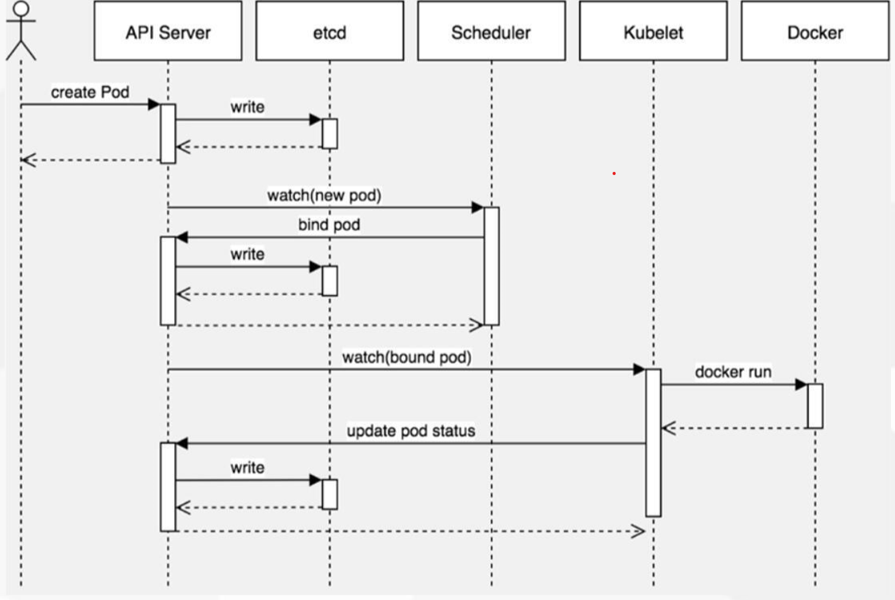

-  最小部署单元
- 一组容器的集合
- 一个Pod中的容器共享网络命名空间
- Pod是短暂的


# 一、Pod容器分类

- **Infrastructure Container：基础容器**
    - 维护整个Pod网络空间

- **InitContainers：初始化容器**
    - 先于业务容器开始执行
- **Containers：业务容器**
    - 并行启动


# 二、镜像拉取策略(imagePullPolicy)

- IfNotPresent：默认值，镜像在宿主机上不存在时才拉取
- Always：每次创建 Pod 都会重新拉取一次镜像
- Never： Pod 永远不会主动拉取这个镜像

```yaml
apiVersion: v1  
kind: Pod  
metadata:
  name: foo
  namespace: awesomeapps  
spec:
  containers:
    - name: foo
      image: janedoe/awesomeapp:v1  
      imagePullPolicy: IfNotPresent

```


### 需认证的Docker仓库镜像拉取


```
#添加用户名密码

kubectl create secret docker-registry myregistrykey --docker-username=admin --docker-password=Harbor12345 --docker-email=admin@163.com --docker-server="192.168.1.27"

kubectl get secret 
```


```yaml
apiVersion: v1
kind: Pod
metadata:
  name: foo
  namespace: awesomeapps
spec:
  containers:
    - name: foo
      image: janedoe/awesomeapp:v1
  imagePullSecrets:
    - name: myregistrykey
```


# 三、资源限制(resources)

Pod和Container的资源请求和限制：

- spec.containers[].resources.limits.cpu
- spec.containers[].resources.limits.memory
- spec.containers[].resources.requests.cpu
- spec.containers[].resources.requests.memory

```yaml
apiVersion: v1
kind: Pod
metadata:
  name: frontend
spec:
  containers:
  - name: db
    image: mysql
    env:
    - name: MYSQL_ROOT_PASSWORD
     value: "password"
    resources:
      requests:
        memory: "64Mi"
        cpu: "250m"
      limits:
        memory: "128Mi"
        cpu: "500m"
  - name: wp
    image: wordpress
    resources:
      requests:
        memory: "64Mi"
        cpu: "250m"
      limits:
        memory: "128Mi"
        cpu: "500m"
```


# 四、重启策略(restartPolicy)

- Always：当容器终止退出后，总是重启容器，默认策略。
- OnFailure：当容器异常退出（退出状态码非0）时，才重启容器。
- Never：当容器终止退出，从不重启容器。

```
apiVersion: v1
kind: Pod
metadata:
  name: foo
  namespace: awesomeapps
spec:
  containers:
  - name: foo
    image: janedoe/awesomeapp:v1
  restartPolicy: Always
```

```
kubectl explain pods.spec
```


# 五、健康检查

### 1、Probe有以下两种类型：

- ####     livenessProbe

  ​     如果检查失败，将杀死容器，根据Pod的restartPolicy来操作。

- ####     readinessProbe

  ​     如果检查失败，Kubernetes会把Pod从service endpoints中剔除。

### 2、Probe支持以下三种检查方法：

- ####     httpGet

  ​     发送HTTP请求，返回200-400范围状态码为成功。

- ####     exec

  ​     执行Shell命令返回状态码是0为成功。

- ####     tcpSocket

  ​     发起TCP Socket建立成功。

```yaml
apiVersion: v1
kind: Pod
metadata:
  labels:
    test: liveness
  name: liveness-exec
spec:
  containers:
  - name: liveness
    image: k8s.gcr.io/busybox
    args:
    - /bin/sh
    - -c
    - touch /tmp/healthy; sleep 30; rm -rf /tmp/healthy; sleep 600
    livenessProbe:
      exec:
        command:
        - cat
        - /tmp/healthy
    readinessProbe:
      exec:
        command:
        - cat
        - /tmp/healthy
      initialDelaySeconds: 5
      periodSeconds: 5
```

官网实例：https://kubernetes.io/docs/tasks/configure-pod-container/configure-liveness-readiness-probes/#


# 六、调度约束



#### 1、nodeName用于将Pod调度到指定的Node名称上

```yaml
apiVersion: v1 
kind: Pod  
  metadata:
    name: pod-example  
    labels:
      app: nginx 
spec:
  nodeName: 192.168.31.65  
  containers:
  - name: nginx  
    image: nginx:1.15


```


#### 2、nodeSelector用于将Pod调度到匹配Label的Node上

```yaml
apiVersion: v1 
kind: Pod  
metadata:
  name: pod-example 
spec:
  nodeSelector:  
    env_role: dev
  containers:
  - name: nginx  
    image: nginx:1.15
```

#### 3、给node打标签方法

```
kubectl label nodes 192.168.1.246 env_role=dev
kubectl label nodes 192.168.1.247 env_role=prod

#验证
kubectl get nodes --show-labels
```


# 七、故障排查

|        **值**        | **描述**                                                     |
| :------------------: | ------------------------------------------------------------ |
|       Pending        | Pod创建已经提交到Kubernetes。但是，因为某种原因而不能顺利创建。例如下 载镜像慢，调度不成功。 |
|       Running        | Pod已经绑定到一个节点，并且已经创建了所有容器。至少有一个容器正在运行 中，或正在启动或重新启动。 |
|      Succeeded       | Pod中的所有容器都已成功终止，不会重新启动。                  |
|        Failed        | Pod的所有容器均已终止，且至少有一个容器已在故障中终止。也就是说，容器 要么以非零状态退出，要么被系统终止。 |
| Unknown、Terminating | 由于某种原因apiserver无法获得Pod的状态，通常是由于Master与Pod所在主机kubelet通信时出错。 |
|   CrashLoopBackOff   | 状态说明容器曾经启动了，但又异常退出了。此时可以先查看一下容器的日志 |
|   ImagePullBackOff   | 通常是镜像名称配置错误或者私有镜像的密钥配置错误导致         |

```
kubectl describe TYPE/NAME
kubectl logs TYPE/NAME [-c CONTAINER]
kubectl exec POD [-c CONTAINER] --COMMAND [args...]
kubectl delete pods <pod> --grace-period=0 --force   #强制删除 Pod
```

官方文档：https://kubernetes.io/docs/concepts/workloads/pods/pod-lifecycle/