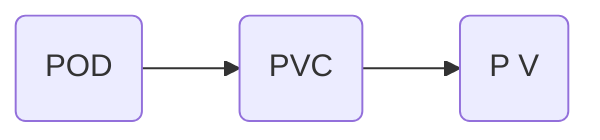
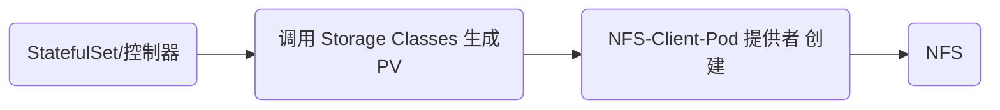

# 一、Volume

https://kubernetes.io/docs/concepts/storage/volumes/

- Kubernetes中的Volume提供了在容器中挂载外部存储的能力
- Pod需要设置卷来源（spec.volume）和挂载点（spec.containers.volumeMounts）两个 信息后才可以使用相应的Volume

常用卷

#### emptyDir

- 创建一个空卷，挂载到Pod中的容器。Pod删除该卷也会被删除。


- 应用场景：Pod中容器之间数据共享


#### hostPath

- 挂载Node文件系统上文件或者目录到Pod中的容器。


- 应用场景：Pod中容器需要访问宿主机文件

#### 直接使用NFS用法

```yaml
apiVersion: apps/v1beta1
kind: Deployment
metadata:
  name: nginx-deployment
spec:
  replicas: 3
  template:
    metadata:
      labels:
        app: nginx
    spec:
      containers:
      - name: nginx
        image: nginx
        volumeMounts:
        - name: wwwroot
          mountPath: /usr/share/nginx/html
        ports:
        - containerPort: 80
      volumes:
      - name: wwwroot
        nfs:
          server: 192.168.1.248
          path: /data/shared
```

> ### Node节点上必须安装，否则调度会失败，查看rpcbind、nfs是否安装
>
> rpm -qa|grep nfs
>
> rpm -qa|grep rpcbind
>
> 安装命令：yum install -y nfs-utils rpcbind


# 二、PersistentVolume

- PersistenVolume（PV）：对存储资源创建和使用的抽象，使得存储作为集群中的资源管理
    -  静态
    -  动态
- PersistentVolumeClaim（PVC）：让用户不需要关心具体的Volume实现细节





Kubernetes支持持久卷的存储插件：

https://kubernetes.io/docs/concepts/storage/persistent-volumes/


#### PVC 模板用法

```yaml
apiVersion: v1
kind: PersistentVolume
metadata:
  name: nfs-pv
spec:
  capacity:
    storage: 5Gi
  accessModes:
    - ReadWriteMany
  nfs:
    path: "/volume1/k8s-nfs"
    server: 192.168.1.11
---
apiVersion: v1
kind: PersistentVolumeClaim
metadata:
  name: nfs-pvc
spec:
  accessModes:
    - ReadWriteMany
  resources:
    requests:
      storage: 5Gi
---
apiVersion: v1
kind: Pod
metadata:
  name: mypod
spec:
  containers:
    - name: nginx
      image: nginx
      volumeMounts:
      - mountPath: "/usr/share/nginx/html/"
        name: wwwroot
  volumes:
    - name: wwwroot
      persistentVolumeClaim:
        claimName: nfs-pvc
```


# 三、PersistentVolume 动态供给

Dynamic Provisioning机制工作的核心在于StorageClass的API对象。

StorageClass声明存储插件，用于自动创建PV。


Kubernetes支持动态供给的存储插件：

https://kubernetes.io/docs/concepts/storage/storage-classes/





#### 创建步骤

https://github.com/kubernetes-incubator/external-storage/tree/master/nfs-client


1.RBCA.YAML

```
kind: ServiceAccount
apiVersion: v1
metadata:
  name: nfs-client-provisioner
---
kind: ClusterRole
apiVersion: rbac.authorization.k8s.io/v1
metadata:
  name: nfs-client-provisioner-runner
rules:
  - apiGroups: [""]
    resources: ["persistentvolumes"]
    verbs: ["get", "list", "watch", "create", "delete"]
  - apiGroups: [""]
    resources: ["persistentvolumeclaims"]
    verbs: ["get", "list", "watch", "update"]
  - apiGroups: ["storage.k8s.io"]
    resources: ["storageclasses"]
    verbs: ["get", "list", "watch"]
  - apiGroups: [""]
    resources: ["events"]
    verbs: ["create", "update", "patch"]
---
kind: ClusterRoleBinding
apiVersion: rbac.authorization.k8s.io/v1
metadata:
  name: run-nfs-client-provisioner
subjects:
  - kind: ServiceAccount
    name: nfs-client-provisioner
    namespace: default
roleRef:
  kind: ClusterRole
  name: nfs-client-provisioner-runner
  apiGroup: rbac.authorization.k8s.io
---
kind: Role
apiVersion: rbac.authorization.k8s.io/v1
metadata:
  name: leader-locking-nfs-client-provisioner
rules:
  - apiGroups: [""]
    resources: ["endpoints"]
    verbs: ["get", "list", "watch", "create", "update", "patch"]
---
kind: RoleBinding
apiVersion: rbac.authorization.k8s.io/v1
metadata:
  name: leader-locking-nfs-client-provisioner
subjects:
  - kind: ServiceAccount
    name: nfs-client-provisioner
    # replace with namespace where provisioner is deployed
    namespace: default
roleRef:
  kind: Role
  name: leader-locking-nfs-client-provisioner
  apiGroup: rbac.authorization.k8s.io     
```
2.class.yaml

```
apiVersion: storage.k8s.io/v1
kind: StorageClass
metadata:
  name: managed-nfs-storage
provisioner: fuseim.pri/ifs # or choose another name, must match deployment's env PROVISIONER_NAME'
parameters:
  archiveOnDelete: "true"  #是否删除POD后，文件归档，一般true

```


3.nfs-提供者 pod

```
---                                                
apiVersion: v1
kind: ServiceAccount
metadata:
  name: nfs-client-provisioner
---
kind: Deployment
apiVersion: apps/v1
metadata:
  name: nfs-client-provisioner
spec:
  selector:
    matchLabels:
      app: nfs-client-provisioner
  replicas: 1
  strategy:
    type: Recreate
  template:
    metadata:
      labels:
        app: nfs-client-provisioner
    spec:
      serviceAccountName: nfs-client-provisioner
      containers:
        - name: nfs-client-provisioner
          image: quay.io/external_storage/nfs-client-provisioner:latest
          volumeMounts:
            - name: nfs-client-root
              mountPath: /persistentvolumes
          env:
            - name: PROVISIONER_NAME
              value: fuseim.pri/ifs
            - name: NFS_SERVER
              value: 192.168.1.11
            - name: NFS_PATH
              value: /volume1/k8s-nfs
      volumes:
        - name: nfs-client-root
          nfs:
            server: 192.168.1.11
            path: /volume1/k8s-nfs  #NFS上配置/data/shared *(rw,no_root_squash)


```


检查

```

kubectl get storageclass
kubectl get pods
kubectl get sa
kubectl get pv,pvc
```

#### 测试动态供给是否正常

```
#1.编写pvc模板

apiVersion: v1
kind: PersistentVolumeClaim
metadata:
  name: test-claim
spec:
  accessModes:
    - ReadWriteMany
  storageClassName: "managed-nfs-storage"
  resources:
    requests:
      storage: 5Gi
      
      
#2.编写POD或控制器使用 PV
apiVersion: v1
kind: Pod
metadata:
  name: test-pod
  labels:
    env: test
spec:
  containers:
    - name: test-pod
      image: nginx
      ports:
        - containerPort: 80
          name: web
      volumeMounts:
      - mountPath: "/usr/share/nginx/html/"
        name: www
  volumes:
    - name: www
      persistentVolumeClaim:
        claimName: test-claim


```


```shell

#查看标签
kubectl get pod --show-lables

#暴露端口测试
[root@master-a nfs]# kubectl expose -f pod.yaml --port=8001 --target-port=80 --type=NodePort --labels=env=test
Error from server (AlreadyExists): services "test-pod" already exists


```

